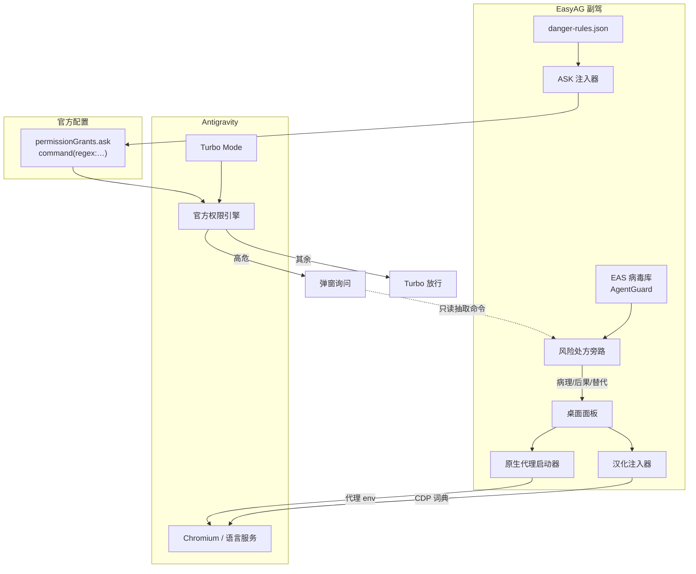
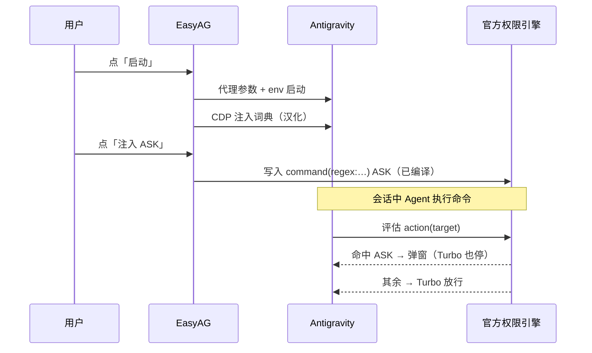

# EasyAntigravity 架构说明

**Turbo Mode 的副驾**：免 TUN 登录 · 汉化界面 · 高危 ASK + 病毒库风险旁路。

---

## 1. 定位（本版起）

| 能力 | 谁负责 | 说明 |
|------|--------|------|
| 自动放行 | **官方 Turbo Mode** | EasyAG 不再模拟点击 |
| 高危询问 | **官方 ASK**（EasyAG 首次启动注入） | 高危正则「永远询问」 |
| 风险处方 | **EasyAG + EAS 病毒库** | Ask 弹窗时旁路匹配，给出病理/后果/安全替代 |
| 免 TUN 登录 | **EasyAG** | 官方无代理配置 |
| 界面汉化 | **EasyAG** | 官方无 i18n |

愿景：EAS 病毒库（AgentGuard）可独立成为 **Agent 时代的「命令病毒库」**；EasyAG 是 Antigravity 侧的第一落地壳。

---

## 2. 总览



---

## 3. 三大模块

### 3.1 免 TUN 登录代理

- **问题**：桌面端登录/推理需出站；TUN、系统代理、DLL 注入均过重或已冲突。
- **做法**：启动 Antigravity 时为 Chromium 传本地 HTTP 代理，并把 `HTTP_PROXY` / `HTTPS_PROXY` 传给语言服务；回环直连。
- **边界**：不改系统代理、不装 TUN、不加载网络 Hook。
- **数据面**：用户自备的本地 HTTP/SOCKS 端口（如 Clash 等）。

### 3.2 界面汉化

- **问题**：官方无界面语言包。
- **做法**：CDP 注入词典，对 DOM 文本节点做实时替换；MutationObserver 跟增量渲染。
- **边界**：**只读 UI 文案**，不点击、不改业务逻辑、不碰权限流。
- **数据面**：`dicts/` 下的词典 JSON。

### 3.3 Turbo 副驾（ASK + 病毒库旁路）

- **问题**：Turbo 静默放行未命中项；纯 Deny 过狠且缺上下文。
- **做法**：
  1. `danger-rules.json` 高危正则，**首次启动注入官方 ASK**（`command(regex:…)`）；
  2. Ask 弹窗出现时，CDP **只读**抽取待审命令；
  3. 匹配 **EAS 病毒库**（`Agentguard-dev/.../signatures.json`）；
  4. 输出「病理 / 破坏后果 / 安全替代」处方，**不代替用户点允许**。
- **边界**：观察与提示；放行决策留给用户。熔断由官方 ASK 保证「一定会停」。
- **防坑**：规则只填 target；同步时清理 `command(command(…))` 双重包裹。

**编译规则**（`scripts/rule-compile.cjs`，与官方语义对齐）：

```text
JS pattern（RegExp.test 部分匹配）
  → 字面空白转为 \s+（保持单 token）
  → regex:.*(?:<pattern>).*     ← 还原 test()，兼容整行 ^…$ 锚定
  → 落盘 command(regex:…)
```

---

## 4. 官方权限匹配语义（Windows 实测定稿）

> 2026-09-25 人机快照差分 + 无害命令矩阵验证。发版前以此为准，勿信「前缀」直觉。

### 4.1 匹配模型

| 形态 | 行为 | 示例 |
|------|------|------|
| **非 `regex:`** | **整行全等**（不是词前缀） | `command(echo hello)` ≡ 命令全文 `echo hello` |
| **`regex:` 单 token** | **整行** `^(?:token)$` | `regex:.*(?:\brm\s+-rf\s+).*` 吃带路径的 rm |
| **`regex:` 多 token** | 空格分 token，**逐词对齐** | `regex:echo -rf .*` ↔ `echo` / `-rf` / 余下 |
| **末尾 `.*`** | 可吞**余下多个词** | `regex:echo .*` 命中 `echo hello world` |
| **引号串** | 算 **1 个词** | `echo -rf "a b"` 为 3 词 |

### 4.2 优先级与策略

```text
Deny  >  Ask  >  Allow
显式规则  >  预设/默认
Ask  可压过  Turbo（Always Proceed）
```

| UI 预设 | `autoExecutionPolicy` | `fileAccessPolicy` | `sandboxMode` |
|---------|----------------------|--------------------|---------------|
| Default | `CASCADE_COMMANDS_AUTO_EXECUTION_OFF` | `AGENT_SETTING_POLICY_ASK` | `false` |
| Full Machine | `OFF` | `AGENT_SETTING_POLICY_ALLOW` | `false` |
| Turbo | `CASCADE_COMMANDS_AUTO_EXECUTION_EAGER` | `ALLOW` | `false` |
| **Custom** | 三旋钮独立可调（仅 Custom 时 UI 显示） | | |

Custom 三旋钮 ↔ JSON：

| UI（仅 Custom） | 字段 |
|-----------------|------|
| Outside of folders file access policy | `fileAccessPolicy`（全局另名 `nonWorkspaceFileAccessPolicy`） |
| Terminal Command Auto Execution | `autoExecutionPolicy` |
| Enable Sandbox Mode (Preview) | `sandboxMode` |

### 4.3 Local Permissions 五通道

| UI | JSON action |
|----|-------------|
| File Access Rules | `read_file` / `write_file` |
| Network Access Rules | `read_url` / `execute_url` |
| Terminal Commands | `command` |
| Commands Outside Sandbox | `unsandboxed` |
| MCP Tools | `mcp` |

落盘：`~/.gemini/config/config.json`（全局）+ `~/.gemini/config/projects/*.json`（项目）。

### 4.4 常见坑（勿回退）

1. UI 输入框**只填 target**，不要写 `command(…)`，否则落盘成 `command(command(…))` 永不命中。  
2. 弹窗「始终允许」写入的是**整行 grant**，换参数会再弹；要变参请写规则列表。  
3. 把 JS 正则整段塞进 `regex:` 而不做 `.*(?:…).*` 包裹 → 被 `^…$` 锁死，`rm -rf /path` 不命中。  
4. 非 `regex:` 的 `command(echo)` **不会**匹配 `echo hello`（整行全等，不是前缀）。

### 4.5 自动化工具

| 脚本 | 用途 |
|------|------|
| `scripts/ag-config.cjs` | 快照/差分、`set-mode` / `set-custom`、`set-rules` / `verify` |
| `scripts/rule-compile.cjs` | danger-rules → 官方 target + 本地语义模拟 |
| `scripts/semantics-lab.cjs` | 无害命令语义矩阵 P1–P10 |

---

## 5. 技术栈

| 层 | 选型 | 原因 |
|----|------|------|
| 后端 | Node.js | Chromium/CDP 生态、JSON 配置、跨平台启动 |
| 壳 | Tauri 2（或便携 exe + 内嵌页） | 轻量窗口 + 系统 WebView |
| 前端 | 单页 HTML/CSS/JS | 控制台体量小，无需重框架 |
| 进程编排 | 子进程启动 Antigravity + 代理 env | 与产品进程隔离 |
| 浏览器控制 | Chrome DevTools Protocol（CDP） | 仅用于汉化注入与状态感知 |
| 权限落地 | 官方 `permissionGrants` JSON | 一等公民，跨会话、执行前生效 |
| 词典 / 规则 | 本地 JSON + 热重载 | 用户可改、可 diff |

---

## 6. 运行时序



---

## 7. 配置与数据流

| 数据 | 位置 | 谁写 | 谁读 |
|------|------|------|------|
| 代理端口、汉化开关 | EasyAG 用户数据目录 | EasyAG 面板 | EasyAG |
| 界面词典 | `dicts/*.json` | 社区/用户 | CDP 注入 |
| 高危正则 | `danger-rules.json` | 用户编辑 | EasyAG 编译器 |
| 官方 Deny | Antigravity 权限配置 | **EasyAG 同步** | **官方引擎** |

**同步原则**：`danger-rules.json` 是唯一规则源（Source of Truth）；官方 `deny` 是编译产物。改规则后「重载 + 同步」，避免两边漂移。

---

## 8. 三端适用性（Desktop / CLI / IDE）

规则语言是同一套官方 `action(target)` / `command(regex:…)`，**语义上三端通用**；差异在配置文件形态与落盘路径。

| 端 | 配置落点 | 规则形态 | 同步现状 |
|----|----------|----------|----------|
| **Antigravity 2.0 桌面** | `~/.gemini/config/config.json` → `userSettings.globalPermissionGrants.deny`；项目 `~/.gemini/config/projects/*.json` | `command(regex:…)` 字符串数组 | **已支持**（全局 + 项目） |
| **Antigravity CLI** | `~/.gemini/antigravity-cli/settings.json` | `permissions.deny: ["command(…)"]` | 结构已知，可扩展 |
| **Antigravity IDE** | 与 2.0 共享项目/全局 grants，或 `~/.gemini/antigravity-ide` | 同桌面权限引擎 | 与桌面项目配置互通时即生效 |

### 结论

- **可以通用**：只要写入的是官方 `command(regex:…)` Deny，CLI / IDE / 桌面共用同一套匹配语义（Deny > Ask > Allow）。
- **不能一份文件打天下**：CLI 的 `settings.json` 与桌面的 `globalPermissionGrants` **不是同一 schema**，需要各写各的，但源规则（`danger-rules.json`）可以只维护一份。
- **建议演进**：Deny 同步器做成多 target（Desktop / CLI / IDE），同一编译结果 fan-out 写入；任一端未安装则跳过。

```text
danger-rules.json  ──编译──►  command(regex:…)
                                │
                ┌───────────────┼───────────────┐
                ▼               ▼               ▼
         桌面 global/项目    CLI settings    IDE grants
```

---

## 9. 安全边界（写进产品原则）

1. **默认不在 EasyAG 侧放行**：放行是 Turbo 的事，EasyAG 只保证黑名单能拦。
2. **不碰凭据**：代理只改启动参数与环境变量，不读写 Google 账号令牌。
3. **CDP 只读**：汉化不点击、不提交表单、不代替用户授权。
4. **同步可审计**：每次写入官方 Deny 可在日志中看到条数与文件列表；用户可在 Antigravity 设置里复核。
5. **正则有限**：静态正则无法穷尽危险变种，需与官方 Ask/Deny、项目隔离、备份策略配合。

---

## 10. 模块边界一览

| 模块 | 依赖 | 不依赖 |
|------|------|--------|
| 代理启动 | 本地 HTTP 代理端口 | 系统代理 / TUN / DLL |
| 汉化 | CDP、词典 JSON | 权限流、审批 UI |
| Deny 同步 | `danger-rules.json`、Antigravity 配置路径 | CDP、自动点击 |
| 面板 | 本地 HTTP API | 云服务 |

---

## 11. 后续可扩展

- 同步到 CLI / IDE 多落点（同一编译，多 schema 适配）
- 规则导入/导出与团队共享
- 与官方 `hooks.json`（`PreToolUse` → `deny`）双轨熔断
- 官方配置变更探测（路径/schema 漂移时告警）

---

*Antigravity 为 Google 产品，本项目与其官方无关。*
